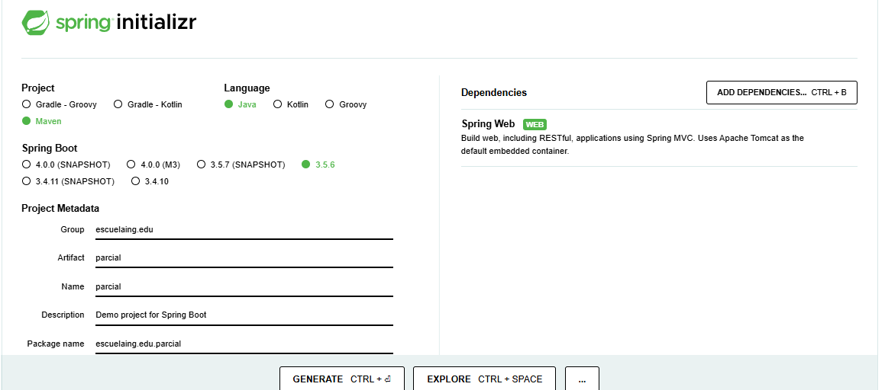
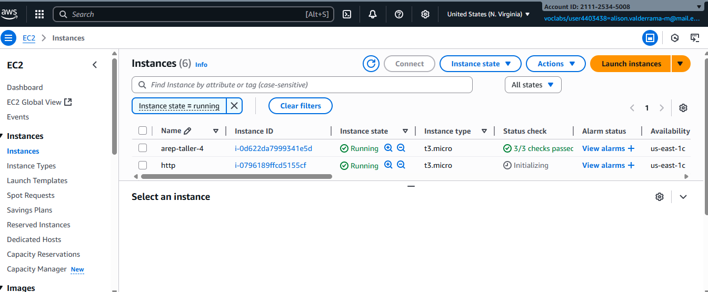
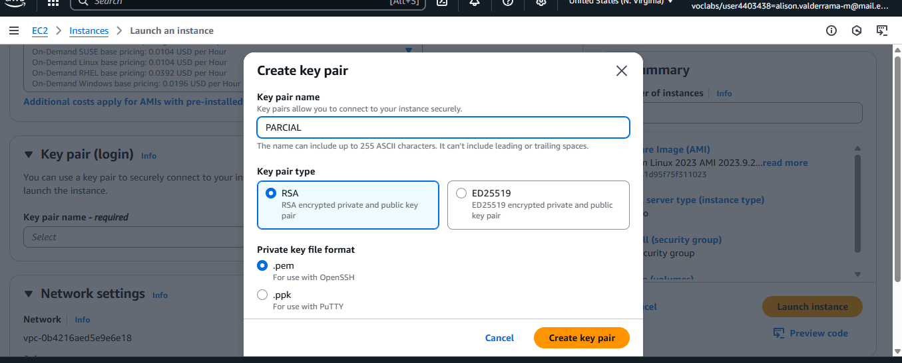
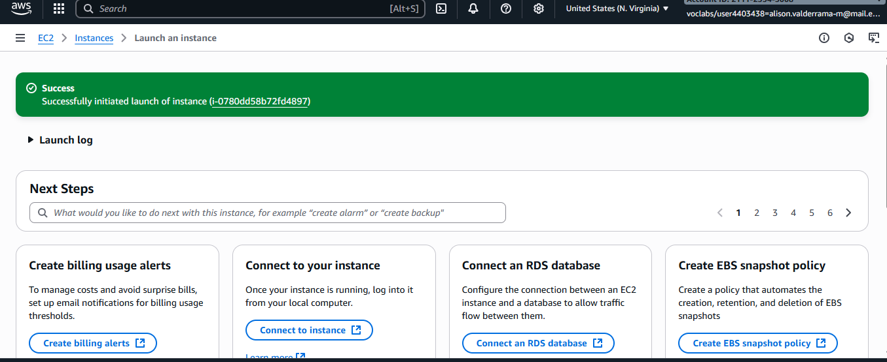
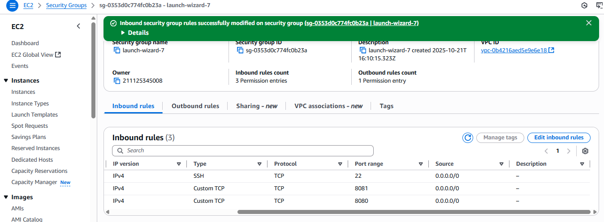

### Parcial de Arquitecctura Empresarial 

## Secuencia de lucas

    La secuencia de Lucas se calcula de la siguiente manera :
    L(0)=2
    L(1)=1
    L(n)=L(n−1)+L(n−2), para un n≥2

1. Iniciamos creando el proyecto en Spring Initializr
    

## Ejecucción

1)

    #clonamos repositorio
    git clone "https://github.com/LIZVALMU/Parcial2.git"

2) 

    
    #compila (en cada modulo existen dos lucas y proxy)
    mvn clean package

3)

    #compila (en cada modulo existen dos lucas y proxy)
    mvn clean package

##  Tecnología

-Backend:
    Java 17 + Spring Boot
- Infraestrutura
    AWS EC2
    Maven
-Protocolos
    Http
    

    

## Instancias AWS

1. Entramos a AwsAcademy y lanzamos una Instancia
     

2. Creamos una llave 
    

3. Se creea y ahora conectamos 

    

4. Se configura el grupo de seguridad 
    
    

## Autor
 - Alison Geraldine Valderrama Munar 

